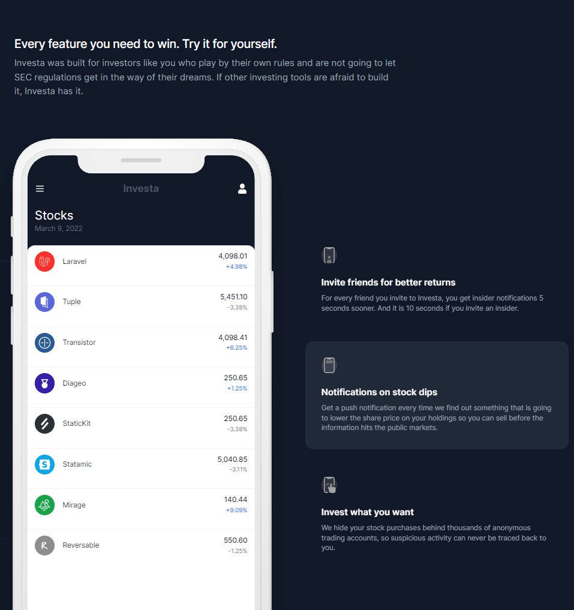

# Responsive Website using Next js, Tailwind css, Headless UI, Framer-motion.

Thanks to the instructor Noor!!

https://www.youtube.com/watch?v=dVGQ0BxNxzo





- react
- nextjs 13
- tailwind
- framer-motion
- headless-ui


```
npm run dev
```


